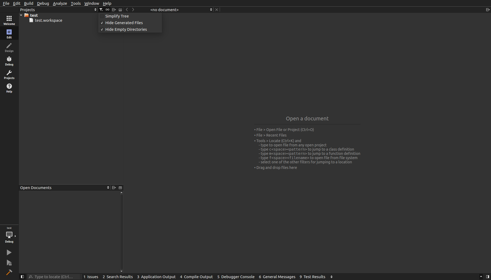

Frequently Asked Questions
===========================
This wiki highlights the frequently asked questions on the issue tracker.

#. :ref:`How to show empty folders? <faq1>`
#. :ref:`Are new files automaticly added to the CMakeLists.txt file?  <faq2>`
#. :ref:`Warning: This file is not part of any project.?  <faq3>`
#. :ref:`Environment variables in .bashrc are not loaded by Qt Creator. <faq4>`
#. :ref:`How do I set the C++ code style to match the ROS Style? <faq5>`

.. _faq1:

How to show empty folders?
--------------------------

By default Qt Creator hides empty folders. In the above image you can see that the workspace **src** folder is not shown. Under the project filters uncheck **Hide Empty Directories**.

.. _faq2:

Are new files automaticly added to the CMakeLists.txt file?
-----------------------------------------------------------

Currently it is the developers responsibility to edit the CMakeLists.txt file.

.. _faq3:

Warning: This file is not part of any project.?
-----------------------------------------------

This can be for several reason.

#. The workspace has not been built from within Qt Creator. Specific flags are passed to cmake which create specific project files which the IDE can parse to build a code model.

#. The file or files have not been added to the CMakeLists.txt file followed by a build from within Qt Creator.

#. Sometime is persist event if you address the previous items, but if code following is working then it should be ignored.

.. _faq4:

Environment variables in .bashrc are not loaded by Qt Creator.
--------------------------------------------------------------

The .bashrc is loaded by bash terminals and is not used by applications. In order for applications to get user defined environment variables you have the two known option below.

#. The environment variables can be added to the build configuration in Qt Creator of the project. This will be required for every new project created in Qt Creator.

#. The environment variables can be added to the .profile file in the users home directory. This is only required once.

.. _faq5:

How do I set the C++ code style to match the ROS Style?
-------------------------------------------------------

#. First, find the Tools tab on the upper toolbar.

#. From the Tools tab, select Options.

   .. image:: ../_static/navigate_to_options_tab.png

#. In the window that pops up, select C++ in the menu on the left.

#. Select the Code Style tab near the top of the pop-up window.

#. Select ROS from the drop down menu.

   .. image:: ../_static/cxx_style_window.png

#. Select 'OK' at the bottom right to apply settings and return to coding!
