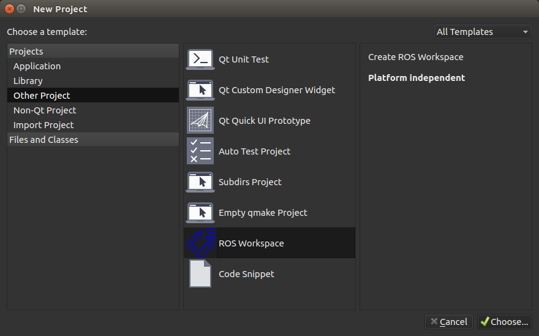
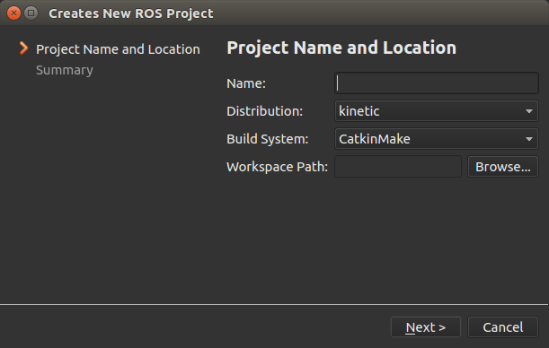
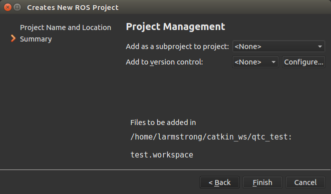
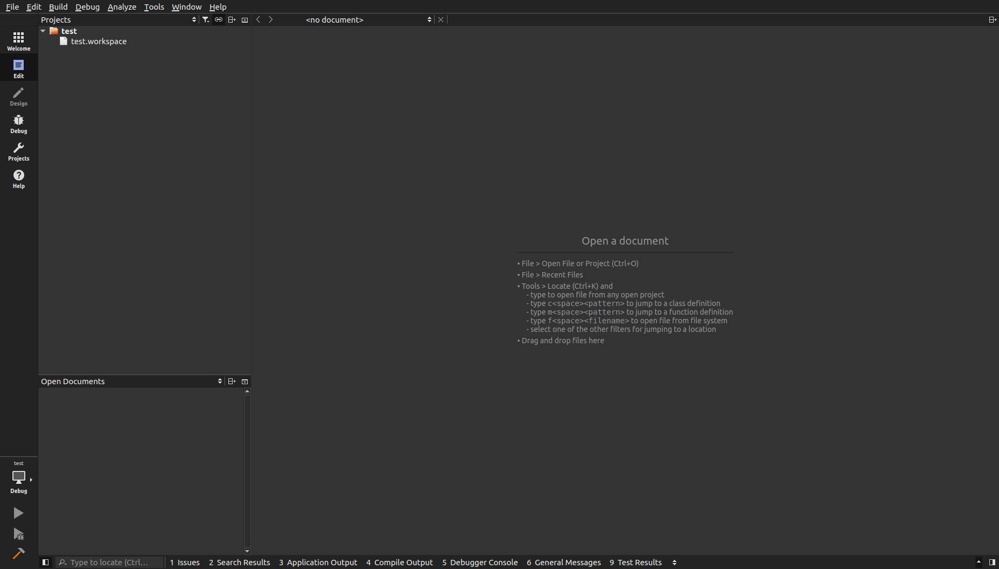

How to Import a ROS Workspace
=============================
This wiki explains the procedure for importing a ROS Workspace.

.. Note:: The pictures may not look identical based on version but the process flow is the same.

User Guide
----------
Step 1
~~~~~~
On the **Welcome** screen select :kbd:`New Project` and the following screen should show.

Step 2
~~~~~~
Under Projects select :kbd:`Other Projects` > :kbd:`ROS Workspace` then select :kbd:`Choose...` and the following screen should show.

Step 3
~~~~~~
Fill out the project information.

==============  ===========  
Field           Description   
==============  ===========  
Name            Name of the project. 
Distribution    The ROS Distribution (indigo, kinetic, etc.) 
Build System    The desired build system.
Workspace Path  The path to the workspace folder.
==============  ===========  

Step 4
~~~~~~
Select :kbd:`Next` and the following screen should show and select :kbd:`Finish` .

Step 5
~~~~~~
The project should be open look similar to the screen below.

Step 6 (Optional)
~~~~~~~~~~~~~~~~~
By default Qt Creator hides empty folders. In the above image you can see that the workspace **src** folder is not shown. Under the project filters uncheck **Hide Empty Directories**.

.. image:: ../_static/show_empty_folders.png
